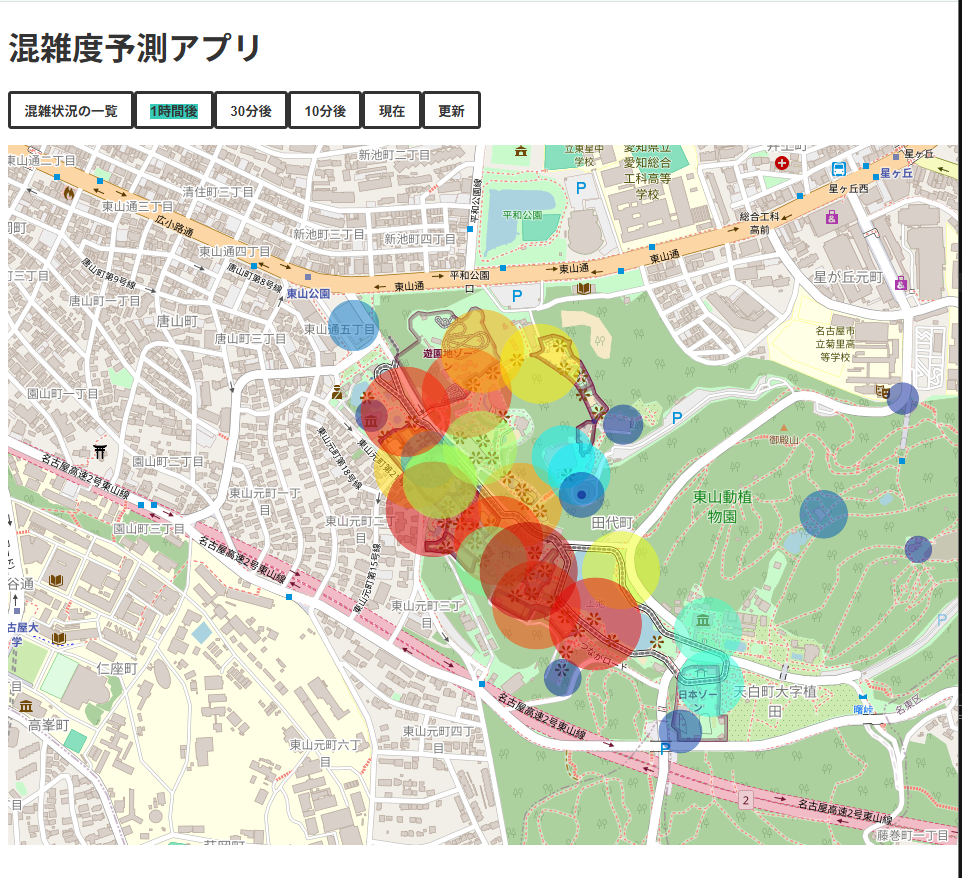
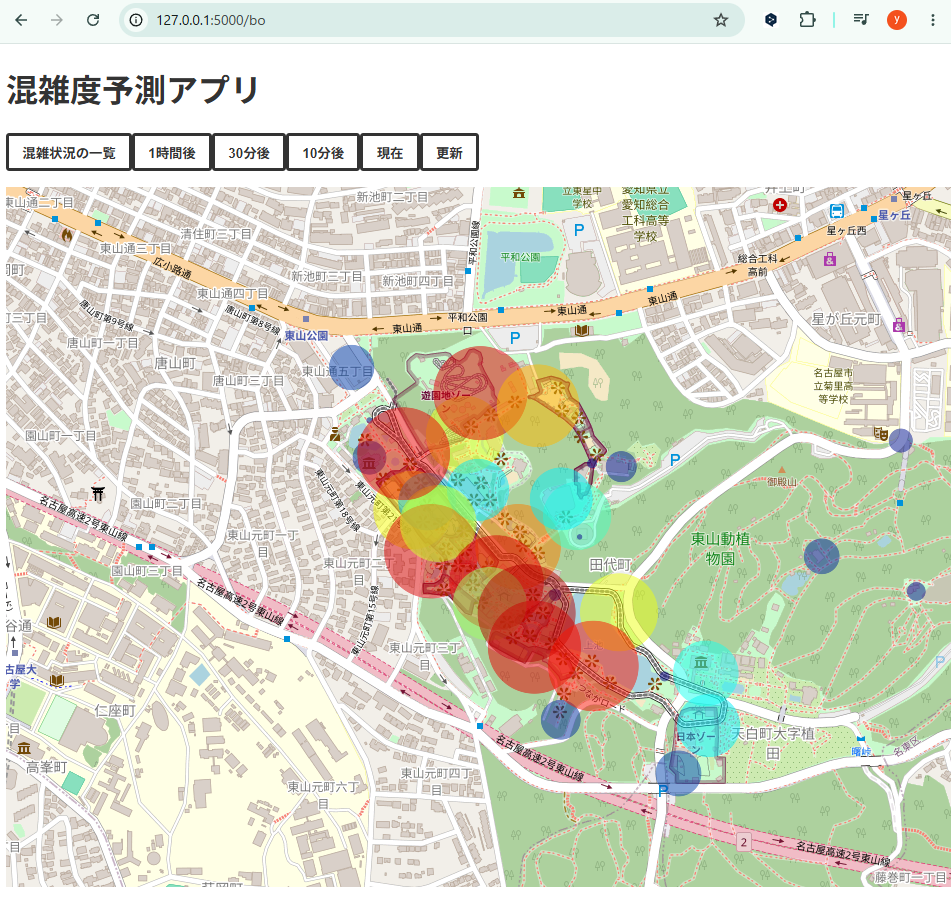
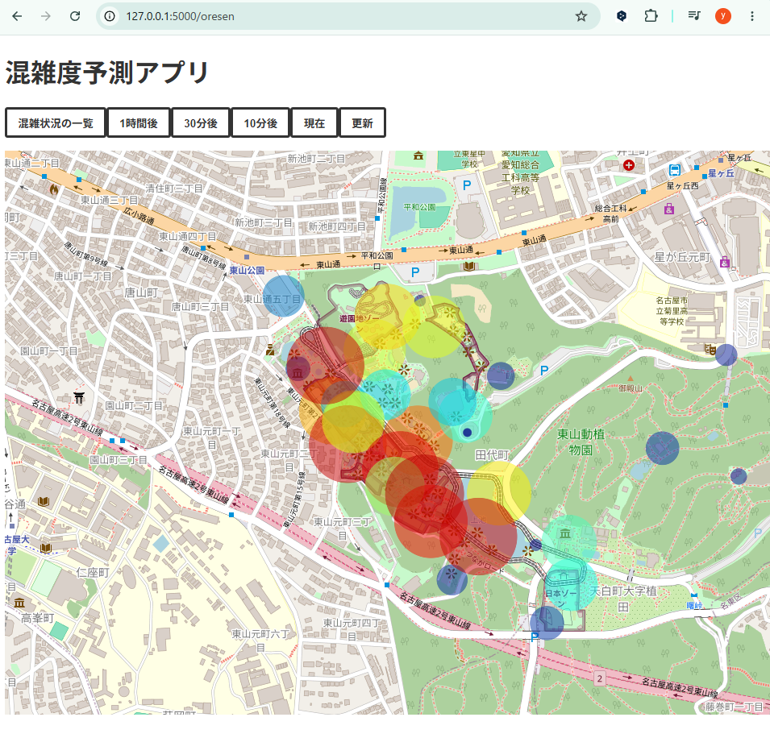
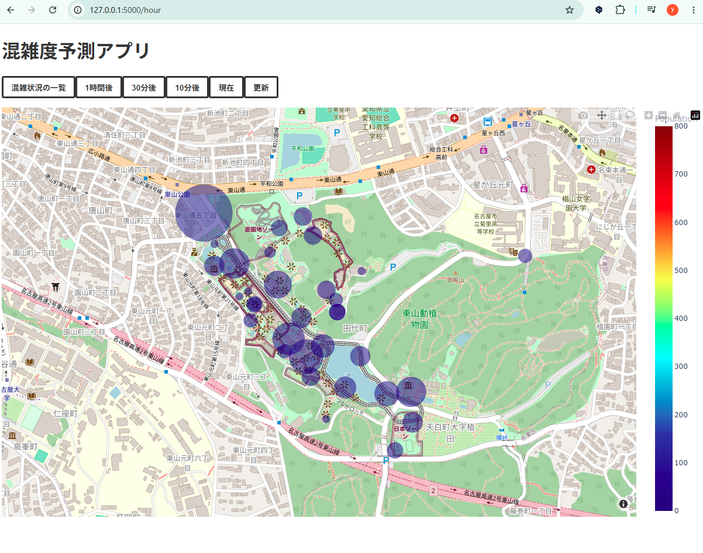
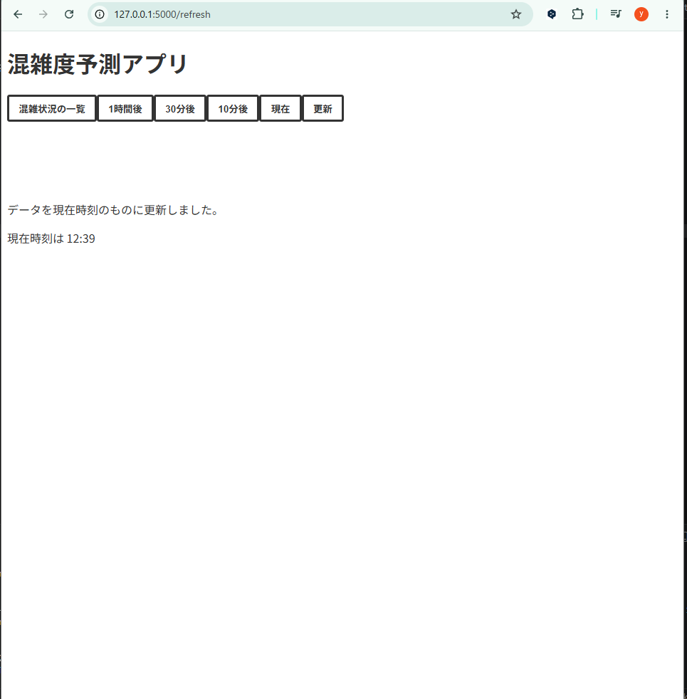
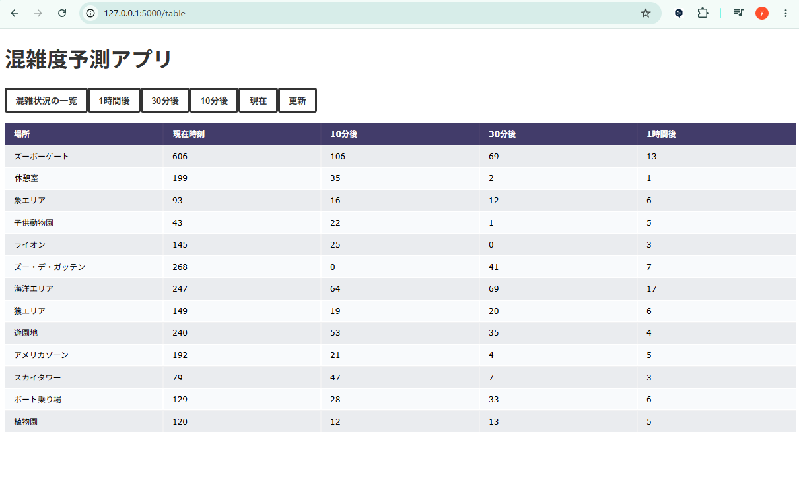

# 東山動植物園混雑予測システム

現在の時刻に対して東山動植物の未来の混雑度合いを推測するwebアプリケーション. 
本開発は東山動植物園協力のもと名古屋大学のプログラム内で行われたもの. 
Wi-Fiパケットセンサにより来場客のスマートフォンなどのパケットを受信し混雑度合いをAIで分析、推定する. 

## システム概要

app.pyを起動することでローカルホストにアプリが起動する. 
フロンエンド:HTML 
バックエンド:Flask 
ニューラルネットワーク:Tensorflow 

## 実行結果

現在の混雑度
 

10分後の混雑度
 

30分後の混雑度
 

1時間後の混雑度
 

更新画面. 現在時刻が表示.
 

混雑度合いの一覧
 
